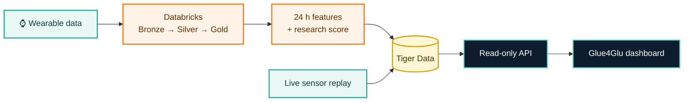

<div align="center">

# Glue4Glu

### Wearable signals. Daily metabolic context.

Glue4Glu connects wearable history, a live sensor-style feed, and an experimental
metabolic-pattern score in one explainable research dashboard.

[](https://wolfhacks.org/)
[](#responsible-use)
[](https://vite.dev/)
[](https://www.databricks.com/)
[](https://www.tigerdata.com/)
[](#ai-use-and-attribution)

**[Open the live demo](https://pparkkila.github.io/WolfHacks26/)** ·
**[Read the project story](DEVPOST_PROJECT_STORY.md)** ·
**[Explore the data flow](databricks/DATA_FLOW.md)**

</div>

> [!IMPORTANT]
> Glue4Glu is a research prototype—not a medical device, glucose monitor,
> diagnosis, or calibrated estimate of disease risk.

## The idea

Metabolic-health data is fragmented. Wearables continuously capture movement,
heart rate, and skin temperature, while HbA1c and glucose measurements live in
separate systems and are reviewed less often.

Glue4Glu brings those signals into one view. It asks a focused research
question: **can recent wearable patterns provide useful context about a
participant's metabolic phenotype without using glucose as a model input?**

The dashboard turns that question into an interactive experience:

- **Live context** — follow a one-second sensor-style feed alongside rolling
  24-hour features and seven-day trends.
- **Explainable scoring** — inspect the wearable features behind an experimental
  higher-HbA1c cohort-resemblance score.
- **Signal awareness** — surface motion and data-quality limitations instead of
  hiding uncertain measurements.
- **Independent validation** — keep CGM outside the wearable-only model so it can
  be used as a separate comparison signal.
- **Honest boundaries** — label simulated, interpolated, observed, and modeled
  values explicitly.

## How it works



The system deliberately separates two speeds of work:

1. **Fast path:** sensor snapshots update the live dashboard experience.
2. **Analytics path:** Databricks prepares minute summaries, rolling features,
   evaluation artifacts, and dashboard-ready records before publishing them to
   Tiger Data.

Dashboard reads never trigger model training or Databricks computation. See
[the full data-flow documentation](databricks/DATA_FLOW.md) for table contracts,
session identifiers, freshness fields, and access boundaries.

## Model at a glance

For participant `i`, the research label is based on observed HbA1c:

```text
yᵢ = 1 when HbA1cᵢ ≥ 5.7%
```

The model builds a 12-feature vector from the preceding 24 hours of wearable
movement and wrist-temperature data. Candidate models are evaluated with
participant-held-out folds; preprocessing and model selection stay inside the
training folds to prevent the same person's windows from leaking into both
training and evaluation.

The evaluated backend release used **660 real 24-hour windows from 15
participants** and reached **60.4% participant-weighted window accuracy**, versus
a **53.3% prior baseline**. This is evidence that the pipeline runs end to end,
not clinical validation. The score remains a cohort-resemblance indicator—not a
glucose reading or disease probability.

## Quick start

### Prerequisites

- [Node.js](https://nodejs.org/) 20.19+ or 22.12+
- npm 10 or newer

### Run the dashboard

```bash
git clone https://github.com/pparkkila/WolfHacks26.git
cd WolfHacks26
npm install
npm run dev
```

Vite prints the local URL, typically `http://localhost:5173/WolfHacks26/`.

### Verify the project

```bash
npm test
npm run build
npm run preview
```

| Command | Purpose |
| --- | --- |
| `npm run dev` | Start the Vite development server on the local network |
| `npm test` | Check cohort labels, score bounds, and replay behavior |
| `npm run build` | Create the production bundle in `dist/` |
| `npm run preview` | Serve the production bundle locally |

The root frontend is intentionally runnable without cloud credentials. It uses
deterministic demo fixtures so the interface remains reproducible offline.

## What is real—and what is simulated?

| Layer | Current status |
| --- | --- |
| HbA1c cohort labels | **Observed** values from PhysioNet BIG IDEAs v1.1.3 |
| Local dashboard wearable values | **Synthetic** deterministic fixtures |
| Local dashboard score and explanations | **Illustrative**; no external AI API is called |
| Databricks model features | Built from real wearable windows in the staged research cohort |
| Live one-second feed | **Synthetic interpolation** of prepared minute summaries |
| CGM | Reserved for independent analysis; never used as a wearable-model feature |

Keeping these boundaries visible is a product requirement, not a footnote.

## Repository map

```text
WolfHacks26/
├── src/                    # Vite dashboard, styles, and deterministic fixtures
├── data/                   # Permitted metadata and source-data documentation
├── databricks/
│   ├── tiger/              # Ingestion, Lakeflow, modeling, replay, and SQL contracts
│   ├── presentation/       # Pitch deck, diagrams, and speaker notes
│   └── DATA_FLOW.md        # End-to-end architecture and backend contract
├── .github/workflows/      # Test, build, and GitHub Pages deployment
├── DEVPOST_PROJECT_STORY.md
├── SPECS.md
└── README.md
```

For the cloud pipeline—including Tiger schema initialization, Databricks
Volumes, secret handling, Lakeflow jobs, model training, and replay—follow the
[Databricks + Tiger setup guide](databricks/tiger/README.md).

## Data sources

- **BIG IDEAs Glycemic Wearable Dataset v1.1.3** supplies the labeled metabolic
  research cohort ([Cho et al., 2026](https://doi.org/10.13026/aw6y-fc44)).
  PhysioNet also requests citation of the dataset's original publication
  ([Bent et al., 2021](https://doi.org/10.1038/s41746-021-00465-w)) and the
  [PhysioNet platform](https://doi.org/10.1038/s44360-026-00096-z).
- **IMU50 v1** supplies an additional wearable cohort for out-of-cohort
  application and compatibility work
  ([La Fratta et al., 2026](https://doi.org/10.5281/zenodo.21468410)). The
  accompanying data article is available at
  [doi:10.1016/j.dib.2026.113201](https://doi.org/10.1016/j.dib.2026.113201).

The datasets represent different people and devices. Records retain a
dataset-qualified participant key and must never be joined on numeric subject ID
alone. Raw or restricted study data should not be committed to this repository.

### Citation-ready references

1. Cho, P., Kim, J., Bent, B., & Dunn, J. (2026). *BIG IDEAs Lab Glycemic
   Variability and Wearable Device Data* (Version 1.1.3) [Data set]. PhysioNet.
   [https://doi.org/10.13026/aw6y-fc44](https://doi.org/10.13026/aw6y-fc44)
2. Bent, B., Cho, P. J., Henriquez, M., et al. (2021). Engineering digital
   biomarkers of interstitial glucose from noninvasive smartwatches. *npj
   Digital Medicine, 4*, 89.
   [https://doi.org/10.1038/s41746-021-00465-w](https://doi.org/10.1038/s41746-021-00465-w)
3. Pollard, T., Moody, B. E., Lehman, L., et al. (2026). PhysioNet as a global
   platform for biomedical research. *Nature Health, 1*(8), 792–795.
   [https://doi.org/10.1038/s44360-026-00096-z](https://doi.org/10.1038/s44360-026-00096-z)
4. La Fratta, I., Calisti, L., Bigelli, L., Chiacchiaretta, P., Mascitelli, A.,
   D'Ardes, D., Di Carlo, P., Lucertini, F., Ferretti, A., Lattanzi, E., &
   Franciotti, R. (2026). *IMU50: A high-frequency multi-modal wrist-worn IMU
   dataset of 50 subjects over 5 continuous days for supervised and
   self-supervised learning in free-living conditions* (Version v1) [Data set].
   Zenodo.
   [https://doi.org/10.5281/zenodo.21468410](https://doi.org/10.5281/zenodo.21468410)
5. La Fratta, I., Calisti, L., Bigelli, L., et al. (2026). IMU50: A
   high-frequency multi-modal wrist-worn IMU dataset of 50 subjects over 5
   continuous days for supervised and self-supervised learning in free-living
   conditions. *Data in Brief, 68*, 113201.
   [https://doi.org/10.1016/j.dib.2026.113201](https://doi.org/10.1016/j.dib.2026.113201)

<details>
<summary><strong>Copy-ready dataset BibTeX</strong></summary>

```bibtex
@article{cho2026bigideas,
  author    = {Cho, Peter and Kim, Juseong and Bent, Brinnae and Dunn, Jessilyn},
  title     = {{BIG IDEAs Lab Glycemic Variability and Wearable Device Data}},
  journal   = {{PhysioNet}},
  year      = {2026},
  month     = apr,
  note      = {Version 1.1.3},
  doi       = {10.13026/aw6y-fc44},
  url       = {https://doi.org/10.13026/aw6y-fc44}
}

@dataset{lafratta2026imu50,
  author    = {La Fratta, Irene and Calisti, Lorenzo and Bigelli, Leonardo and
               Chiacchiaretta, Piero and Mascitelli, Alessandra and
               D'Ardes, Damiano and Di Carlo, Piero and Lucertini, Francesco and
               Ferretti, Antonio and Lattanzi, Emanuele and Franciotti, Raffaella},
  title     = {{IMU50: A High-Frequency Multi-Modal Wrist-Worn IMU Dataset of
               50 Subjects Over 5 Continuous Days for Supervised and
               Self-Supervised Learning in Free-Living Conditions}},
  publisher = {Zenodo},
  year      = {2026},
  version   = {v1},
  doi       = {10.5281/zenodo.21468410},
  url       = {https://doi.org/10.5281/zenodo.21468410}
}
```

</details>

## AI use and attribution

This project discloses AI assistance in both development and architecture:

- **Development assistance:** [OpenAI Codex](https://developers.openai.com/learn/codex)
  was used to help analyze the repository, draft and edit documentation—including
  this README—and run repeatable checks. AI suggestions were reviewed and edited;
  the project team remains responsible for the code, scientific claims, and final
  presentation.
- **Current browser demo:** the local “Insight assistant” returns deterministic,
  feature-based explanations from application code. It does **not** call an
  external language-model API.
- **Extended explanation architecture:** the presentation materials describe
  [OpenAI Agents SDK](https://developers.openai.com/api/docs/guides/agents/sdk)
  for orchestration and guardrails, with the
  [Google Gemini API](https://ai.google.dev/gemini-api/docs) for contextual
  response generation. This integration is an architecture component, not part
  of the self-contained Vite demo in `src/`.

Suggested citations for the AI tools and documentation:

6. OpenAI. (n.d.). *Codex*. OpenAI Developers. Retrieved October 4, 2026, from
   [https://developers.openai.com/learn/codex](https://developers.openai.com/learn/codex)
7. OpenAI. (n.d.). *Agents SDK*. OpenAI Developers. Retrieved October 4, 2026,
   from
   [https://developers.openai.com/api/docs/guides/agents/sdk](https://developers.openai.com/api/docs/guides/agents/sdk)
8. Google. (n.d.). *Gemini API*. Google AI for Developers. Retrieved October 4,
   2026, from
   [https://ai.google.dev/gemini-api/docs](https://ai.google.dev/gemini-api/docs)

## Responsible use

Glue4Glu is designed for research exploration and hackathon demonstration only.
The project does not claim to:

- diagnose diabetes or prediabetes;
- replace a continuous glucose monitor, laboratory test, or clinician;
- infer blood glucose directly from a watch;
- provide a calibrated probability of current or future disease; or
- validate performance across populations, devices, or real-world conditions.

Future work includes a larger and more diverse cohort, external validation,
device-transfer testing, stronger signal-quality detection, and feature-level
explanations traceable to exact source windows.

## Documentation

- [Project story](DEVPOST_PROJECT_STORY.md) — inspiration, implementation,
  challenges, lessons, and next steps
- [Data flow](databricks/DATA_FLOW.md) — system architecture and dashboard data
  contract
- [Pipeline setup](databricks/tiger/README.md) — reproducible Databricks and
  Tiger Data instructions
- [Project outline](PROJECT_OUTLINE.md) — the original concept and demo framing
- [Repository outline](REPO_OUTLINE.md) — frontend structure and scope guardrails
- [Technical specs](SPECS.md) — datasets, requirements, and early design options

## License

Source code is available under the [GNU General Public License v3.0](LICENSE).
Dataset licenses and access terms remain with their respective publishers.

<div align="center">

Built for **WolfHacks 2026** with a commitment to useful signals, visible
uncertainty, and responsible health-data storytelling.

</div>
