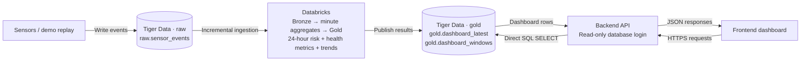

# Data flow: Tiger → Databricks → Tiger → application

Tiger Data stores incoming sensor events and serves processed dashboard data.
Databricks handles ingestion, aggregation, and analytics. The backend reads the
published results directly from Tiger; the frontend accesses them through the
backend API.

## Current live demo — October 4

Active session: **`continuous-oct4-v1`**, all **66 participants**.
The diagram below describes the slower analytics path. A separate fast path now
writes **one-second sensor snapshots directly to `gold.sensor_latest` in Tiger**.
The backend should poll **`gold.dashboard_live` every second**: this view joins
the latest sensor snapshot with the most recent analytics payload.

Rolling metrics and trailing-24-hour risk refresh on a **15-minute cadence until
noon Eastern, then a five-minute cadence until the 3 p.m. stop**. Databricks
processing adds latency. Sensor writes do not wait for those jobs. Read
`sensor_published_at` and `analytics_published_at` separately to detect stale data.

One-second values are labeled synthetic interpolations of the prepared minute
summaries, not measured 1 Hz readings. Only latest snapshots are stored each
second; durable history and model inputs remain canonical minute records.
The existing `dashboard_reader` has SELECT access to both new objects, not INSERT.
The earlier smoke-test details below are historical evidence for the separate
17-person fallback session, not the current cohort limit.



The two Tiger boxes represent **the same PostgreSQL database**, with separate
`raw` and `gold` schemas. The SELECT arrow is a query; dashboard rows flow back
to the backend. A dashboard request does not trigger Databricks computation.

## Processing stages

1. **Ingest events into Tiger.** Incoming event envelopes are stored in
   `raw.sensor_events`, a Timescale hypertable. Event IDs support retries without
   inserting duplicate events. The current demo producer writes directly to
   Tiger; the separate HTTP ingestion API was not exercised by the smoke test.
2. **Copy events into Databricks Bronze.** The incremental ingestion job reads
   recent Tiger events using `received_at` and merges them into
   `workspace.wolfhacks_bronze.sensor_events`. A lookback rereads recent events;
   the merge prevents duplicate rows.
3. **Calculate rolling metrics and predictions.** Databricks processes sensor
   data into minute summaries and trailing 24-hour windows, with hourly historical
   points and 15-/5-minute live points for seven-day trends. A separately trained model scores recent wearable
   patterns for resemblance to the study's higher-HbA1c group. The finite demo
   transports already-derived minute summaries, not raw
   high-frequency samples. Its replay minutes and dashboard windows live in
   `workspace.wolfhacks_demo`.
4. **Publish results back to Tiger.** Databricks writes dashboard windows to
   `gold.dashboard_windows`. The `gold.dashboard_latest` view selects the most
   recent window for each session and participant.
5. **Serve the application.** The backend queries Tiger with a dedicated
   SELECT-only login and returns JSON over HTTPS. The frontend renders cards
   and charts without holding database credentials.

## Historical data and demo replay

Historical dataset files land in Databricks Volumes and are processed there;
they do not all pass through the live Tiger event-ingestion path. Prepared demo
history seeds the rolling calculations separately.

The demo fixture provides eight input days per participant: one warmup day plus
seven days of hourly dashboard history. A ninth day is reserved for replay.
Synthetic gap fills and extensions are explicitly labeled, and demo data is
excluded from model training.

The completed smoke test used 17 participants and two accelerated replay batches.
It processed 2,040 unique live-path events and published 2,890 dashboard windows.
This verifies the bounded data path, not a continuously running sensor service
or the full 66-person dataset. No continuous replay schedule was created by the
test. Published Tiger results remain readable after Databricks processing stops,
provided the Tiger service is available.

The subsequent rolling-risk verification scored all existing windows and added
one more replay hour. The same `submission-smoke-v1` session now has **2,907
scored windows** and **3,060 unique replay events** across 17 participants.
Training and publication both completed successfully; the finite replay stopped.

## Backend table contract

| Object | Purpose |
| --- | --- |
| `gold.dashboard_live` | Current sensor cards joined with the latest slower analytics; poll every second |
| `gold.sensor_latest` | Latest synthetic sensor snapshot per session and participant |
| `gold.dashboard_latest` | Latest analytics window per session and participant |
| `gold.dashboard_windows` | Historical hourly and live sub-hourly windows for trend charts |

The two analytics objects expose `session_id`, `participant_key`, `window_end`, `payload`, and
`published_at`. The `payload` JSONB object contains the dashboard metrics.

- Filter every query by `session_id`; use `continuous-oct4-v1` for the current
  66-person demo, or `submission-smoke-v1` for the 17-person fallback.
- Filter participant trends by the dataset-qualified `participant_key`, such as
  `demo:big_ideas:001` or `demo:imu50:00`. The datasets contain different people;
  never join them on numeric IDs alone.
- `window_end` is the exclusive end of the 24-hour window in simulated event
  time. `published_at` records the actual database publication time.
- Repeated SELECT queries only read the latest published results; they do not
  advance the replay or recompute metrics.

Example latest-results query, with `$1` bound to the session ID:

```sql
SELECT participant_key, payload, sensor_published_at, analytics_published_at
FROM gold.dashboard_live
WHERE session_id = $1
ORDER BY participant_key;
```

## Read-only access boundary

Create a dedicated backend login, such as `dashboard_reader`, with database
`CONNECT`, schema `USAGE`, and `SELECT` on all published objects in `gold`. Do
not grant it admin-role membership, ownership, or write permissions. Verify its
effective permissions before sharing it, including permissions inherited from
shared grants. A read-only transaction default is an extra safeguard, not a
replacement for SELECT-only permissions.

`tiger/grant_output_reader.sql` grants the existing `dashboard_reader` access to
all six current `gold` tables/views and sets SELECT defaults for future outputs
created by the executing owner. It does not grant raw-schema access or writes.
The two older prediction tables are included for completeness; the active live
dashboard should still use `gold.dashboard_live` and the continuous session ID.

Keep its password in backend deployment secrets and connect over TLS. Never
share the `tsdbadmin` credentials with the frontend, put database credentials in
a browser bundle, or commit passwords to the repository. This document does not
provision the login or deploy the backend/frontend integration.

## Frontend interpretation

- Show a **Simulated replay** label and preserve synthetic-data indicators.
- Movement metrics use **g**; temperature is **wrist skin temperature in °C**,
  not core body temperature. Heart rate uses **bpm**.
- Missing heart rate, including IMU50's currently unavailable derived HR, stays
  `null`/unavailable rather than becoming zero.
- `wearable_risk_indicator` is a **0–100 experimental cohort-resemblance index**,
  not a diabetes probability or measured glucose. Higher scores indicate greater
  resemblance to the study's higher-HbA1c group. There are no validated clinical
  categories or action thresholds. Older, unscored exports may still contain null.
- `risk_change_24h_points` compares the current score with the window ending
  24 hours earlier; it is null when that history is unavailable.
- Preserve `risk_model_version`, `risk_evaluation`, and
  `risk_outside_training_range`. IMU50 device transfer is not validated.

## Rolling model lifecycle

`train_rolling_risk.py` reads real minute data from Silver, constructs past-only
24-hour features with hourly window ends, and trains on the 15 approved labeled
BIG IDEAs participants. It excludes participant 015 and all synthetic/demo data.
Movement and skin-temperature features are shared across datasets; heart rate
remains a dashboard metric rather than an input to this cross-dataset model.

Outer evaluation holds out a whole participant. Inner model selection also
separates participants, and fitting/evaluation weight participants equally so
longer recordings do not dominate. Window counts are not independent people.
The experiment is development on a small reused cohort, not clinical validation.

The deployed release is `0006be934ae7480d922f248ddd25a17d`. Its evaluation used
660 real windows from 15 people and achieved 60.42% participant-weighted window
accuracy versus a 53.33% prior baseline. Probability-quality metrics are mixed;
the score is not calibrated disease risk. See the
[complete evaluation report](tiger/rolling_risk_evaluation.json).

Model artifacts and evaluation reports are versioned in Databricks. Dashboard
publication pins one release per replay session and scores history plus each
new hourly window. Known training participants use their held-out-person model;
IMU50 and the excluded demo participant use the final model with an unvalidated
application label. This does not turn synthetic replay results into test metrics.
The publisher updates existing Tiger payloads in place without changing table
names or read permissions. No retraining happens during a dashboard request.

## Team handoff files

- [Dashboard payload types](tiger/dashboard_contract.ts)
- [Latest and seven-day trend SQL queries](tiger/dashboard_queries.sql)
- [Exported sample JSON for offline frontend development](tiger/dashboard_sample.json)
- [Finite recording/replay helper](tiger/run_demo_test.py)
- [Detailed setup and recording instructions](tiger/README.md)

The sample JSON contains current snapshots for all 17 demo participants and a
168-point hourly trend for BIG IDEAs participant 001. It can be used while the
backend connection is being configured.
